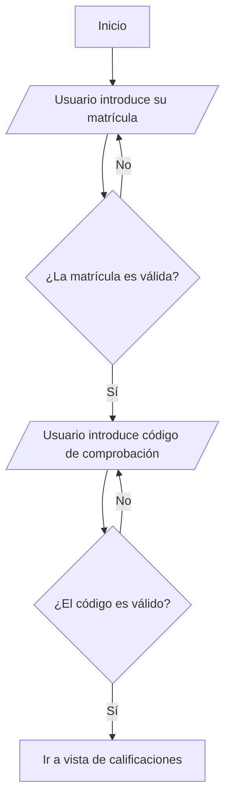

# 🎓 SIGACE — Frontend

### Sistema Inteligente de Gestión Académica y Control de Estudios

**SIGACE** es una solución integral diseñada para la automatización de procesos administrativos y académicos en instituciones educativas. Esta aplicación web centraliza la información de estudiantes, docentes y representantes bajo una interfaz moderna, intuitiva, responsiva y de alta fidelidad visual.

---

## ✨ Servicios principales

<!-- **Gestión de Inscripciones:** 📝 Procesos de matriculación y registro de estudiantes por periodos académicos. -->

- **Carga de Calificaciones:** 📊 Carga y visualización de notas estructuradas por lapsos, asignaturas y secciones.
- **Gestión de Usuarios y Accesos:** 👥 Vistas y paneles adaptados según el rol (Administradores, Docentes, Estudiantes y Representantes).
<!-- - **Reportes Académicos:** 📄 Generación e impresión de boletas, constancias y listados en PDF de forma nativa desde el cliente. -->
- **Sincronización en Tiempo Real:** 🔗 Consumo eficiente de datos académicos (grados, secciones, carga docente) mediante la API del backend.
- **Planes Evaluativos:** 📊 Carga el plan evaluativo de la carga academica asiganda al docente.
- **Configuracion de Peridos academicos:** 🗃️ Configura el inicio del nuevo ciclo escolar y momentos academicos desde una interfas limpia y amigable.

---

## 🛠️ Stack tecnológico

### Core y Renderizado

- **Next.js 16 (App Router):** Estructura basada en carpetas con soporte nativo para Server Components, layouts compartidos y optimización de rutas.
- **React 19:** Biblioteca base para interfaces dinámicas, optimizada mediante el nuevo compilador nativo de React.

### Interfaz de Usuario (UI/UX)

- **Tailwind CSS v4:** Motor de estilos en cascada de última generación para un diseño minimalista, fluido y enfocado en el modo oscuro.
- **Iconografía Dinámica:** Combinación flexible de **Font Awesome 7 (React)** y **Lucide React** para micro-interacciones y consistencia visual.
- **React Hot Toast:** Sistema de notificaciones e indicadores emergentes para flujos de acción.

### Comunicación y Estado Local

- **Axios:** Cliente HTTP para la comunicación con la API externa del backend.
- **JS Cookie:** Gestión y almacenamiento seguro de cookies en el navegador para la persistencia del estado de autenticación.

---

## Flujos 🚦

Acontinuacion se muestran algunos flujos de los procesos principale.

### Consulta de Calificaciones sin loguearse

